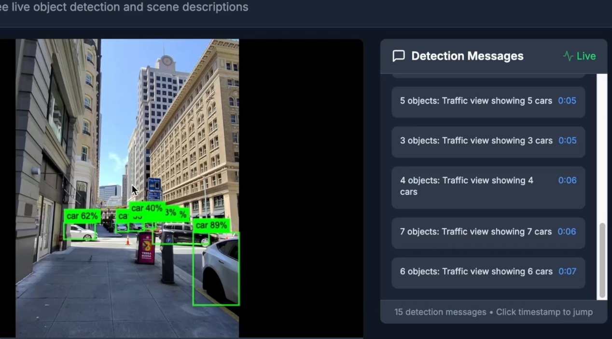

# 🎥 Real-time Video Analysis

A modern web application that provides real-time object detection and scene analysis for uploaded videos using YOLOv8 and computer vision.



## ✨ Features

- **🎬 Auto-Play Analysis** - Videos start automatically with live object detection
- **🤖 Real-time Detection** - YOLOv8-powered object recognition at 2fps
- **📝 Scene Descriptions** - Natural language descriptions of detected scenes
- **🎯 Bounding Box Overlay** - Visual detection results overlaid on video
- **💬 Live Commentary** - YouTube-style comment feed with timestamps
- **🔄 Synchronized Playback** - Analysis syncs with video play/pause state
- **📱 Responsive Design** - Works on desktop and mobile devices
- **⚡ Fast Processing** - Optimized for real-time performance

## 🛠️ Tech Stack

### Backend
- **FastAPI** - Modern async web framework
- **YOLOv8 (Ultralytics)** - State-of-the-art object detection
- **OpenCV** - Computer vision and video processing
- **PyTorch** - Deep learning framework
- **NumPy** - Numerical computing

### Frontend
- **Next.js 14** - React framework with App Router
- **TypeScript** - Type-safe development
- **Tailwind CSS** - Utility-first styling
- **HTML5 Canvas** - Frame capture and overlay rendering

## 🚀 Quick Start

### Prerequisites
- Python 3.8+
- Node.js 16+
- npm or yarn

### Backend Setup

1. **Clone the repository**
```bash
git clone https://github.com/yourusername/realtime-video-analysis.git
cd realtime-video-analysis
```

2. **Install Python dependencies**
```bash
pip install fastapi uvicorn ultralytics opencv-python torch numpy
```

3. **Run the backend server**
```bash
python main.py
```
The API will be available at `http://localhost:8000`

### Frontend Setup

1. **Navigate to frontend directory**
```bash
cd frontend  # or wherever your Next.js app is located
```

2. **Install dependencies**
```bash
npm install
# or
yarn install
```

3. **Set environment variables**
```bash
# Create .env.local
NEXT_PUBLIC_API_BASE_URL=http://localhost:8000
```

4. **Run the development server**
```bash
npm run dev
# or
yarn dev
```
The app will be available at `http://localhost:3000`

## 📖 Usage

1. **Upload Video**: Drag & drop or select a video file (MP4, MOV, AVI, WebM)
2. **Automatic Analysis**: Video auto-plays with real-time object detection
3. **View Results**: See live detection messages and bounding boxes
4. **Navigate**: Click timestamps to jump to specific moments

### Supported Video Formats
- MP4
- MOV
- AVI
- WebM

## 🔌 API Documentation

### Upload Video
```http
POST /upload-video
Content-Type: multipart/form-data

Form Data:
- file: video file
```

### Analyze Frame
```http
POST /analyze-frame
Content-Type: application/json

{
  "frame_data": "base64_encoded_image",
  "timestamp": 12.34
}
```

### Stream Video
```http
GET /video/{video_id}
```

### Health Check
```http
GET /health
```

## 📁 Project Structure

```
realtime-video-analysis/
├── backend/
│   ├── main.py              # FastAPI application
│   ├── analyzer.py          # YOLOv8 analysis engine
│   └── requirements.txt     # Python dependencies
├── frontend/
│   ├── app/
│   │   ├── page.tsx         # Main application page
│   │   └── components/
│   │       ├── VideoUploadPlayer.tsx
│   │       └── DetectionMessages.tsx
│   ├── package.json
│   └── tailwind.config.js
└── README.md
```

## 🎯 Key Components

### Backend Components

- **`VisionAnalyzer`** - Core YOLOv8 analysis engine
- **`FastAPI Routes`** - REST API endpoints
- **`Frame Analysis`** - Real-time video frame processing
- **`Scene Description`** - Natural language generation

### Frontend Components

- **`VideoUploadPlayer`** - Video upload and playback with analysis
- **`DetectionMessages`** - Real-time message feed
- **`Canvas Overlay`** - Bounding box visualization

## ⚙️ Configuration

### Backend Configuration
- **Analysis Rate**: 2fps (500ms intervals)
- **Model**: YOLOv8 nano (yolov8n.pt) for speed
- **Video Storage**: Temporary session-based storage

### Frontend Configuration
- **Auto-play**: Enabled by default
- **CORS**: Configured for cross-origin video access
- **Layout**: Fixed-height responsive design

## 🐛 Debugging

The application includes comprehensive logging:

### Backend Logs
```bash
🔍 === FRAME ANALYSIS START ===
📏 Frame dimensions: (720, 1280, 3)
🎯 Total detections: 3
📝 === GENERATING SCENE DESCRIPTION ===
```

### Frontend Logs (Browser Console)
```bash
🎯 analyzeFrame called
📹 Video ref: true Canvas ref: true
🌐 Sending analysis request
✅ Analysis successful
```

## 🔧 Development

### Running in Development Mode
```bash
# Backend with auto-reload
uvicorn main:app --reload --host 0.0.0.0 --port 8000

# Frontend with hot reload
npm run dev
```

### Adding New Detection Classes
Modify the `class_names` processing in `analyzer.py` to handle additional YOLO classes or custom models.

## 📊 Performance

- **Analysis Speed**: ~2fps real-time processing
- **Model Size**: YOLOv8 nano (~6MB)
- **Memory Usage**: Optimized for session-based processing
- **Supported Resolution**: Up to 4K video input

## 🤝 Contributing

1. Fork the repository
2. Create a feature branch (`git checkout -b feature/amazing-feature`)
3. Commit your changes (`git commit -m 'Add amazing feature'`)
4. Push to the branch (`git push origin feature/amazing-feature`)
5. Open a Pull Request

## 🙏 Acknowledgments

- [Ultralytics YOLOv8](https://github.com/ultralytics/ultralytics) - Object detection model
- [FastAPI](https://fastapi.tiangolo.com/) - Web framework
- [Next.js](https://nextjs.org/) - React framework
- [OpenCV](https://opencv.org/) - Computer vision library
